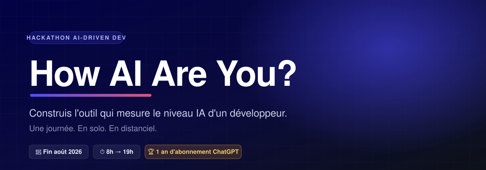
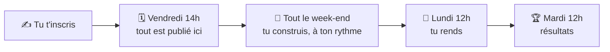

 

<!-- ─────────────────────────────────────────────────────────────────────────
     TOUT CE QUI PEUT ENCORE BOUGER TIENT DANS LE BLOC CI-DESSOUS.
     Date, horaires, format d'équipe, lot. Ne rien dupliquer plus bas.
     ───────────────────────────────────────────────────────────────────── -->

|  |  |
| --- | --- |
| 📅 **Quand** | Du vendredi 28 au lundi 31 août 2026 |
| ⏱ **Fenêtre** | Vendredi 14h → lundi 12h, soit 70 heures |
| 🌍 **Où** | 100 % distanciel et asynchrone, sur Discord |
| 👤 **Format** | Solo. Une personne, un projet |
| 🏆 **Lot** | Un an d'abonnement ChatGPT, plus la mise en avant du projet |
| ⚖️ **Licence** | MIT. AI-Driven Dev pourra réutiliser ton projet en t'attribuant le travail |

---

## 🧩 Le problème

Avec l'IA, n'importe qui sort une feature propre, testée, bien découpée. Le code ne dit donc plus grand-chose de celui qui l'a demandé.

Alors comment tu sais où tu en es vraiment ? Et en entretien, ou dans une équipe, comment tu situes quelqu'un ?

On a bien une grille de niveaux en interne, mais elle est auto-déclarative : chacun se place où il veut, et tout le monde se trouve un peu meilleur qu'il n'est.

## 🎯 Le sujet

> **Construis un outil qui, à partir d'éléments concrets sur un développeur, rend son niveau et l'explique.**

Le signal s'est déplacé du code vers la manière d'y arriver : comment on cadre, ce qu'on vérifie, ce qu'on refuse, ce qu'on délègue et ce qu'on garde.

Le plus dur n'est pas de construire l'outil. C'est de décider **quoi mesurer**. On n'a pas la réponse, et c'est pour ça qu'on en fait un hackathon.

La forme est libre : une app, un agent, un script, un questionnaire, une mise en situation. L'outillage aussi : langage, modèle, framework, code généré à 100 % par IA si tu veux. C'est le sujet même de l'événement.

## 🗺️ Comment ça se passe

## 📦 À l'ouverture, vendredi 14h

Rien avant. Tout le monde démarre en même temps.

Ce qui apparaît dans ce dépôt à l'ouverture :

- l'énoncé précis et ce sur quoi votre outil sera jugé ;
- la grille de niveaux, dans un format prêt à être lu par un outil ;
- des profils de développeurs fictifs, avec le niveau qu'on leur attribue, pour vérifier que le vôtre tombe juste ;
- les conventions de rendu.

En attendant, [le salon Discord](https://discord.gg/hB7JkN8EPe) est le seul endroit où il se passe quelque chose.

## 🔨 Pendant le week-end

Tu travailles en asynchrone, quand tu veux et au rythme que tu veux. Personne n'est de garde et il n'y a aucun créneau à tenir : la seule échéance est le rendu.

Le salon Discord reste ouvert du début à la fin, pour poser une question ou montrer où tu en es.

## 🎬 Ce que tu rends, lundi 12h

Un dépôt public sous licence MIT, avec ton outil qui tourne, une page qui explique ta méthode, et une courte vidéo qui le montre en action.

Pas besoin d'interface graphique. Un outil en ligne de commande bien fait vaut mieux qu'une jolie UI vide.

## ⚔️ S'inscrire

👉 **[Ouvrir le formulaire](https://github.com/ai-driven-dev/how-ai-are-you/issues/new?template=inscription.yml)**

Pas de backend, pas de collecte d'emails. Ton compte GitHub suffit. Tu apparais dans [`directory.json`](./directory.json) dans la minute.

Un empêchement ? [Tu te désinscris](https://github.com/ai-driven-dev/how-ai-are-you/issues/new?template=desinscription.yml) aussi vite, sans avoir à te justifier.

## 🔮 Après

Tous les projets sont publiés et comparés. Les meilleures idées sont consolidées en un outil unique qui atterrira sur le site et servira à la communauté pour se situer.

 

**Prêt ?**

Organisé par <a href="https://www.ai-driven-dev.fr/">AI-Driven Dev</a> · Contenu sous licence <a href="./LICENSE">MIT</a>

